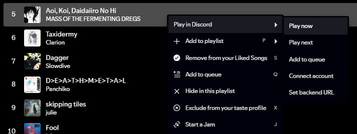

# nightqueue

Right-click tracks in the Spotify desktop client -> they play in your Discord voice channel.



## Deploy

Credentials:

- Discord bot token - [Discord Developer Portal](https://discord.com/developers/applications) -> New Application -> Bot -> Reset Token. Invite with `bot + applications.commands` scopes and Connect/Speak permissions.
- Spotify app - [Spotify Developer Dashboard](https://developer.spotify.com/dashboard) -> Create app. Grab Client ID/Secret and add `https://your-domain/pair/callback` as a Redirect URI.

Everything runs as three [Docker](https://docs.docker.com/engine/install/) Compose containers (bot/api, Lavalink, yt-cipher) — Docker is the only host dependency.

```bash
git clone https://github.com/Z1xus/nightqueue.git && cd nightqueue
cp .env.example .env   # fill in
docker compose up -d
```

Bot/API listens on port 7187; `PUBLIC_BASE_URL` must point to it over HTTPS (reverse proxy or tunnel of your choice). State lives in `./data` (sqlite).

On non-residential IPs YouTube blocks anonymous playback: run `bun scripts/yt-oauth.ts` once, authorise with a burner Google account when prompted, then `docker compose up -d --force-recreate lavalink`.

## Install the extension

Requires [Spicetify](https://spicetify.app/docs/getting-started) and [Bun](https://bun.sh).

```bash
bun install
cd apps/spicetify-extension
bun run build
cp dist/nightqueue.js "$(dirname "$(spicetify -c)")/Extensions/"   # windows: %appdata%\spicetify\Extensions
spicetify config extensions nightqueue.js
spicetify apply
```

In Spotify, right-click any track -> Play in Discord -> set the backend URL, then Connect account: run `/link CODE` in Discord and finish the Spotify sign-in on the pairing page.

## Commands

`/play <url or search>` `/pause` `/resume` `/skip` `/stop` `/queue` `/remove <position>` `/move <from> <to>` `/clear` `/volume <0-150>` `/disconnect` `/link <code>`

All commands also work as text with the `nq!` prefix (`nq!play mascara deftones`), configurable via `COMMAND_PREFIX`. Requires the Message Content intent: Discord Developer Portal -> Bot -> Privileged Gateway Intents.
